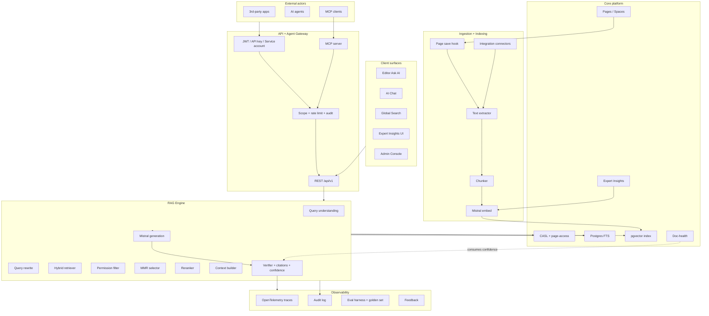
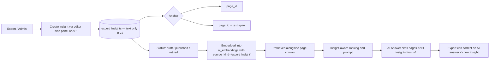
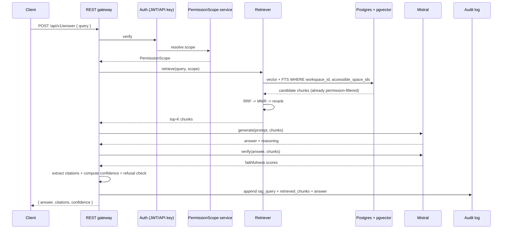
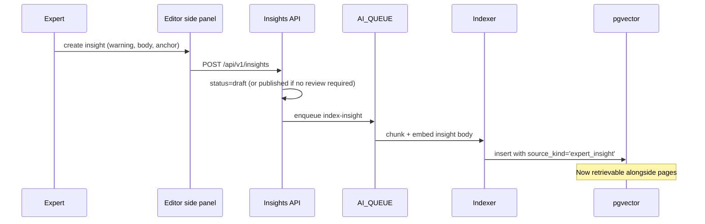
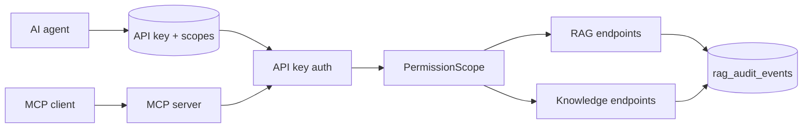
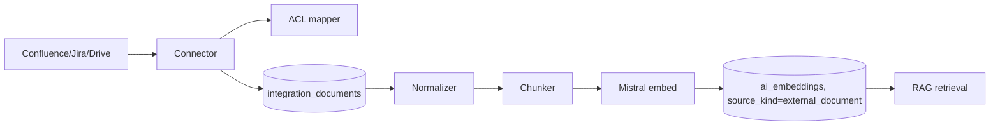

# ConqrHub — Master Implementation Plan

> **Status:** Draft v2 — proposal for review
> **Last updated:** 2026-04-30
> **Owner:** Yahya Hibaoui
> **Audience:** Engineering, product, AI workstream reviewers
>
> **v2 changes (2026-04-30):** Expert Insights repositioned as a core differentiator (P0). Insights Core moved up to Branch 3 — before Hybrid Retrieval and Answers. AI Answers v1 cites both pages and insights from day one; the previously separate "insights-rag-boost" branch dissolves into Answers. Vector table renamed `ai_embeddings` with `source_kind` (`page` | `expert_insight` | `external_document`) + `source_id` from inception. v1 insight scope simplified: text only, four types (warning / correction / notice / recommendation), draft / published / retired status, page or span anchor, Expert/Admin permissions. Multimedia insights deferred to Branch 12 (multimodal).

This document is the source-of-truth roadmap for evolving ConqrHub from a wiki into a permission-safe, citation-grounded enterprise knowledge intelligence platform. It defines the target architecture, the branch-by-branch delivery plan, and the acceptance criteria each PR must hit.

---

## Table of contents

1. [Executive summary](#1-executive-summary)
2. [Current repository assessment](#2-current-repository-assessment)
3. [Product modules map](#3-product-modules-map)
4. [Target architecture](#4-target-architecture)
5. [RAG architecture](#5-rag-architecture)
6. [Expert Insight architecture](#6-expert-insight-architecture)
7. [Permissions architecture](#7-permissions-architecture)
8. [Integration architecture](#8-integration-architecture)
9. [API + MCP architecture](#9-api--mcp-architecture)
10. [Branch-by-branch roadmap](#10-branch-by-branch-roadmap)
11. [Database schema plan](#11-database-schema-plan)
12. [Environment configuration](#12-environment-configuration)
13. [Testing strategy](#13-testing-strategy)
14. [Evaluation strategy](#14-evaluation-strategy)
15. [Diagrams](#15-diagrams)
16. [Risk analysis](#16-risk-analysis)
17. [Final recommendation](#17-final-recommendation)
18. [Appendix A — Open questions](#appendix-a--open-questions)
19. [Appendix B — Working assumptions](#appendix-b--working-assumptions)
20. [Appendix C — Glossary](#appendix-c--glossary)

---

## 1. Executive summary

**ConqrHub is an enterprise knowledge intelligence platform** — a permission-safe, citation-grounded knowledge brain that serves humans, AI agents, and external apps from a single source of truth. The wiki layer is the substrate; the differentiating value is the **trusted-answer layer** built on top: hybrid retrieval, expert-verified insights, hallucination control, traceable citations, and agent-safe APIs.

**Strategic direction.** v1 ships a high-accuracy RAG over text pages **and Expert Insights** with Mistral, hybrid retrieval (vector + Postgres FTS), MMR + reranking, dual-source citations (pages + insights), refusal logic, and full audit. Expert Insights are the differentiator — verified human knowledge that overrides stale pages. v2 layers AI Chat (UI already scaffolded), Agent Gateway, and MCP. v3 expands to multimodal ingestion (PDF → audio/video, including multimedia insights) and external integrations (Confluence/Jira/Drive/SharePoint).

**Main technical goal.** Ship a production-grade, permission-enforcing RAG pipeline that doc-health can trust (so `AI_CONFIDENCE_WEIGHT` flips from 0 → 0.10) without overbuilding — and where Experts can already correct AI behavior on day one. Every branch is independently mergeable, gated by env, and revertable.

**Why this roadmap.** It front-loads the foundation (provider, embeddings) and lands Expert Insights before retrieval ships, so the very first AI Answer the platform produces can already prefer expert-verified content over raw pages. It treats agents and MCP as a clean API layer over a working RAG, not vice versa. Each branch ships behind a feature flag so partial-deploy is safe.

---

## 2. Current repository assessment

### What exists today

| Layer | State | Path |
|------|------|------|
| Backend | NestJS + Fastify, Kysely, Postgres, Redis, BullMQ | `apps/server/src/` |
| Frontend | React 18 + Vite + Mantine + Tiptap + Yjs | `apps/client/src/` |
| Search | **Postgres FTS** (`tsv` + `pg-tsquery`) — Typesense optional driver | `apps/server/src/core/search/search.service.ts` |
| Search analytics | **Already shipped** — `search_events` table, query/click tracking, success metrics | `core/search/search-analytics.service.ts`, migration `20260428T100000` |
| Permissions | CASL workspace + space abilities; **page-level access via `page_access` + `page_permissions`** | `core/casl/`, `core/page/page-access/page-access.service.ts` |
| AI provider | Vercel AI SDK wrapper, openai/gemini/ollama/openai-compatible, `embed` / `embedMany` ready | `ee/ai/providers/ai-provider.service.ts` |
| Ask AI (P1) | `/api/ai/generate` + `/stream`, 10 actions, streaming SSE | `ee/ai/generate/` |
| **AI Chat scaffolding (back + front)** | `ai_chats` + `ai_chat_messages` tables; full chat UI in `client/src/ee/ai-chat/` — **only the RAG backend is missing** | migrations `20260409T132415-ai-chat`, `20260427T180000-ai-confidence-columns` |
| Doc-health | Scoring, snapshots, alerts, broken-links, duplicates, knowledge-gaps — **AI confidence weight wired but at 0** | `core/doc-health/` |
| API tokens | `api_keys` table exists (no service/controller yet); CASL has `Subject.API` | migration `20250912T101500-api-keys` |
| Shares | Public share links per page with `include_sub_pages`, `search_indexing` flags | migration `20250408T191830-shares` |
| Hocuspocus | Persists ProseMirror + Yjs + `text_content` on every store; ideal embedding hook | `collaboration/extensions/persistence.extension.ts:96` |
| AI listener | `page.listener.ts` already enqueues to AI_QUEUE on PAGE_CREATED/DELETED/SOFT_DELETED/RESTORED — **no processor yet, PAGE_UPDATED missing** | `database/listeners/page.listener.ts` |
| Env getters | 8 AI-related getters; no RAG-specific config | `integrations/environment/environment.service.ts:247-296` |

### Gaps relevant to the ConqrHub vision

1. No vector store, no embeddings indexed — Branch 2.
2. No retrieval pipeline (hybrid, MMR, rerank) — Branches 3–4.
3. No grounded-answer endpoint — Branch 5.
4. No Expert Insight model — Branches 6–7.
5. AI Chat backend has no RAG grounding despite confidence columns existing — Branch 9.
6. `api_keys` table is dead — no service, no scoped retrieval endpoint, no audit — Branch 10.
7. No MCP server, no agent gateway — Branch 11.
8. No external integrations (Confluence/Jira/Drive…) — Branch 12.
9. No multimodal ingestion — Branch 12.
10. No retrieval evaluation framework or golden dataset — Branch 8.
11. Mistral is not a first-class driver (works via openai-compatible but no defaults / docs) — Branch 1.

---

## 3. Product modules map

| Module | Purpose | Users | Current state | Missing | Depends on | Priority |
|--------|---------|-------|---------------|---------|------------|----------|
| Workspace & Tenant Mgmt | Multi-tenant isolation | Admin, Super Admin | Done | Super Admin tier | — | P3 |
| Spaces & Pages | Knowledge container + content | All | Done | — | — | — |
| Knowledge Lifecycle | Verify, approve, expire | Owners, Experts | Mostly (verifications exist) | Expert sign-off → boost | — | P2 |
| Expert Insights | Verified human enrichment — **core differentiator** | Experts | Missing | Text-only v1 module; multimedia in v3 | Branch 3 | **P0** |
| Search & Discovery | Find content fast | All | FTS + analytics | Hybrid + vector | Branch 3 | **P0** |
| AI Answers | Cited Q&A (pages **and** Expert Insights) | All | Missing | Full pipeline | Branches 1–6 | **P0** |
| AI Chat | Multi-turn grounded chat | All | UI scaffolded; backend stub | RAG-grounded backend | Branch 9 | **P1** |
| RAG Engine | Retrieval orchestration | Internal | Missing | Full pipeline | Branches 2–4 | **P0** |
| Embeddings | Vector index of content | Internal | Missing | pgvector + indexer | Branch 2 | **P0** |
| Integrations Hub | External knowledge ingest | Admin | Missing | Connectors framework | Branch 12 | P2 |
| API Layer | External REST | Apps, Agents | `api_keys` table only | Service/controller/scopes | Branch 10 | **P1** |
| MCP Server | Agent-native protocol | Agents | Missing | Full server | Branch 11 | **P1** |
| Agent Gateway | Scoped service accounts | Apps, Agents | Missing | Auth + rate limits + audit | Branch 10 | **P1** |
| Permissions & ACL | Permission-safe everything | All | Workspace + Space + Page; CASL | Agent scopes; chunk filter at retrieval | Branches 3, 10 | **P0** |
| Audit & Observability | Trace every retrieval | Admin, Compliance | Noop audit module | Real audit + traces | Branches 8, 10 | **P1** |
| Evaluation & Feedback | Continuous quality | Internal team | Missing | Golden set + metrics | Branch 8 | P1 |
| Admin Console | Workspace AI settings | Admin | Toggles exist | Per-feature config UI | Spread | P2 |

---

## 4. Target architecture



**Layer map**

1. **Ingestion** — Hocuspocus persistence hook + listener events + integration connectors push content into a queue.
2. **Processing** — text extractor (PM JSON → text already exists; PDF/OCR later) → chunker → embedder.
3. **Indexes** — pgvector (semantic) + Postgres `tsvector` (lexical, already there).
4. **Retrieval** — query rewrite → hybrid (vector ∪ FTS) → permission filter (chunk-level) → metadata filter → MMR → reranker → context builder.
5. **Generation** — Mistral with grounded prompt → verifier → citation extractor → confidence scorer → audit emit.
6. **Surfaces** — Ask AI, AI Chat, AI Answers (search bar), Expert Insights side panel, MCP tools, REST.
7. **Permission engine** — single `PermissionScope` object resolved once per request, enforced at SQL level (chunk filter) and at output level (refuse if chunks insufficient).
8. **Observability** — every retrieval emits a `rag_query` row with retrieved chunk IDs, scores, verifier output, confidence, latency stages, cost.

---

## 5. RAG architecture

### Pipeline

```mermaid
flowchart LR
  Q[User/Agent question] --> AUTH[Authenticate JWT or API key]
  AUTH --> PS[Resolve PermissionScope: workspaceId, accessibleSpaceIds, accessiblePageIds]
  PS --> QU[Query understanding: language, intent, entities]
  QU --> QR{Rewrite?}
  QR -->|enabled| QRW[Mistral-small rewrite + decompose]
  QR -->|disabled| Q1[Pass-through]
  QRW --> HR[Hybrid retrieval]
  Q1 --> HR
  HR --> V[Vector top-K=40 cosine]
  HR --> K[FTS top-K=40 BM25-like rank]
  HR --> M[Metadata filter space/page/freshness]
  V & K & M --> PF[Permission filter SQL JOIN to page_access]
  PF --> MERGE[RRF merge -> top-N=20 candidates]
  MERGE --> MMR[MMR lambda=0.5 -> top-12]
  MMR --> RR[Reranker -> top-6]
  RR --> CB[Context builder: 6 chunks + neighbors + insight boost]
  CB --> CTX[Token budget 6000]
  CTX --> GEN[Mistral-large generation, low temp 0.2, max 1024]
  GEN --> VER[Verifier: faithfulness check]
  VER --> CIT[Extract citations with span offsets]
  CIT --> CONF[Confidence: faithfulness * coverage * source quality]
  CONF --> REF{Refuse?}
  REF -->|conf < 0.4 or 0 sources| R1[Refusal: I don't know + suggest sources]
  REF -->|else| ANS[Answer + citations + confidence]
  ANS --> AUDIT[Audit log: query, chunks, scores, answer, conf, latency]
  R1 --> AUDIT
```



### Defaults

| Parameter | Default | Rationale |
|-----------|---------|-----------|
| `AI_RAG_VECTOR_TOP_K` | 40 | Recall first |
| `AI_RAG_KEYWORD_TOP_K` | 40 | Same |
| `AI_RAG_HYBRID_MERGE` | RRF (k=60) | Reciprocal-rank fusion handles score-scale mismatch |
| Pre-rerank candidates | 20 | Reranker latency budget |
| `AI_RAG_MMR_LAMBDA` | 0.5 | Balance relevance/diversity |
| Post-MMR | 12 | Feeds reranker |
| Final top-K (`AI_RAG_FINAL_TOP_K`) | 6 | Best-of-class default; keeps context lean |
| `AI_RAG_MAX_CONTEXT_TOKENS` | 6000 | Mistral-large fits this comfortably; leaves headroom |
| LLM temperature | 0.2 | Faithfulness |
| Refusal threshold | confidence < 0.4 OR 0 used citations | Safe default |
| Verifier | secondary Mistral-small pass with the answer + chunks; outputs `faithfulness ∈ [0,1]` per claim | Bounded second call; ~$0.0001/query |

### Source-aware context

Retrieved chunks carry their `source_kind` (`page` | `expert_insight` | `external_document`) into the prompt. The context block is rendered with explicit headers — e.g. `[Source 3 — Expert Insight (warning), published 2026-03-12]` — so the model can both reason about provenance and cite correctly. The prompt template explicitly instructs: **"When an Expert Insight contradicts a page, prefer and cite the Expert Insight."**

### Hallucination prevention

- **System prompt invariant.** "Answer ONLY using the provided sources. If insufficient, say you don't know."
- **Verifier.** Runs after generation, scores per-claim faithfulness, drops or flags claims unsupported by cited chunks.
- **Citation enforcement.** Every assertive sentence must carry at least one `[n]` marker tied to a retrieved chunk; un-cited sentences are stripped or trigger refusal.
- **Refusal-first design.** Better to say "I don't know" than to bluff. Refusal correctness is a tracked metric (Branch 7).

### Citation strategy

- Inline `[1] [2]` markers in answer text.
- Each citation references `(page_id, chunk_index, chunk_offset_start, chunk_offset_end)`.
- UI: hovering `[1]` shows page title + snippet; clicking jumps to page with the chunk highlighted.

---

## 6. Expert Insight architecture

Expert Insights are the platform's differentiator: verified human knowledge that the RAG retriever surfaces alongside pages and that the answer prompt is instructed to prefer when it contradicts older content. v1 keeps the surface area deliberately small so the feature ships in Branch 3 without delaying retrieval.



### v1 scope (Branch 3)

| Aspect | v1 | Deferred |
|--------|----|----------|
| Content | Text only (title + body) | Images, video, audio, file attachments — Branch 12 |
| Insight types | `warning`, `correction`, `notice`, `recommendation` | `explanation`, `clarification`, `best_practice`, `risk`, `compliance`, `operational` — v2 |
| Anchor | Page (`page_id`) or page + text span (`{page_id, span: [start,end]}`) | Chunk anchor, AI-answer anchor — v2 |
| Status | `draft` / `published` / `retired` | Multi-stage review queue — v2 |
| Permissions | Expert role + Admin can create; space readers can view published | External-user views, fine-grained per-insight ACL — v2 |
| Searchability | Postgres FTS via own `tsv` column | — |
| Embeddability | Indexed into `ai_embeddings` with `source_kind='expert_insight'` | — |

### Data model (v1)

**`expert_insights`** — id, workspace_id, space_id, page_id (NOT NULL in v1 — every insight anchors to a page), span_anchor (jsonb `{start, end}`, nullable), insight_type (enum: `warning` | `correction` | `notice` | `recommendation`), title, body (text), status (enum: `draft` | `published` | `retired`), creator_id, reviewed_by_id (nullable), reviewed_at (nullable), expires_at (nullable), tsv (tsvector, populated by trigger), created_at, updated_at, deleted_at.

Indexes: `(workspace_id, page_id)`, `(workspace_id, status)`, GIN on `tsv`.

**Out of v1.** No `expert_insight_media` table; no `expert_insight_links` table. Both arrive in Branch 12 (multimodal) along with the broader anchor model. Keeping the v1 schema lean avoids prematurely committing to a generalized link model.

### Lifecycle

1. Expert creates insight → status `draft`.
2. Expert (or Admin) publishes → `published`. Workspace setting `AI_INSIGHT_REQUIRE_REVIEW` (default `false`) controls whether self-publish is allowed; when `true`, only Admins or designated reviewers can flip to `published`.
3. RAG only surfaces `published` insights.
4. Insights expire if `expires_at` passes → automatically transitioned to `retired` by a cron job.
5. Expert can mark "correct AI answer X" → creates a `correction` insight anchored to the page that produced the bad citation. (The link to the answer itself is logged in `rag_audit_events` cross-reference; a dedicated `expert_insight_links` table is deferred to v2.)

### RAG influence — built into Branches 4-6 from day one

- Branch 3 indexes insights into `ai_embeddings` with `source_kind='expert_insight'`. No separate "boost" branch.
- Branch 4 (Hybrid retrieval) retrieves over **all** `source_kind` values; `ai_embeddings` is source-agnostic.
- Branch 5 (MMR + rerank) is source-kind-aware: chunk headers include the source kind so the reranker can upweight insights, and MMR diversifies across kinds.
- Branch 6 (AI Answers) prompt template explicitly instructs: "Where an expert insight contradicts a page, prefer the insight and cite it." Confidence scorer treats insights as higher-quality sources. UI shows insights in a dedicated "Expert says:" block above sources.

### Why insights ship before retrieval (Branch 3, not Branch 6+)

- Insights are part of the trust story, not a v1.5 boost. The first answer the system ever produces should be allowed to cite an insight.
- The schema (`source_kind` + `source_id`) is the same whether or not insights exist, but committing to it before retrieval ships means no migration churn later.
- Expert workflows (create / review / publish) take time to validate with users; landing them early gives weeks of UI feedback before retrieval depends on the data.

---

## 7. Permissions architecture

The single hardest correctness problem in enterprise RAG. Design rules:

1. **Permission resolution happens once per request**, producing a `PermissionScope` object.
2. **Permission filter is enforced at the SQL level** during retrieval — never as a post-hoc filter on returned chunks (avoids ranking distortion + leak risk).
3. **Embeddings are workspace-scoped**; cross-workspace retrieval is impossible by construction (no `OR` across workspaces in retrieval queries, ever).
4. **Service account = principal.** API keys and MCP service accounts resolve to a "scope vector" identical in shape to a user's scope.
5. **No chunk wins** if any of: workspace mismatch, space not in scope, page soft-deleted, page-level deny.

### PermissionScope shape

```ts
type PermissionScope = {
  principalKind: 'user' | 'api_key' | 'service_account' | 'share_link';
  principalId: string;
  workspaceId: string;
  accessibleSpaceIds: string[];        // pre-computed via existing CASL
  pageAllowList?: string[];            // explicit grants via page_access
  pageDenyList?: string[];             // explicit denies
  features: { rag: boolean; chat: boolean; agent: boolean };
  audit: { sessionId: string; reason?: string };
};
```

### Retrieval-time enforcement

- Vector query and FTS query both have a `WHERE workspace_id = $1 AND space_id = ANY($2) AND page_id NOT IN $deny AND page_id IN $allow_or_unrestricted` clause.
- Page-level permission check via JOIN to `page_access` / `page_permissions` — this matches the existing `PageAccessService.validateCanView` logic so behavior stays consistent across UI and RAG.
- Soft-deleted pages (`deleted_at IS NOT NULL`) excluded by default; admin-only debug API can override (Branch 8).

### Agent / API key scopes (Branch 10)

- Each `api_key` row gets a sibling `api_key_scopes` table: scope_kind (workspace_read | workspace_admin | space_read | space_write | page_read | rag_query | mcp_invoke), target_id (nullable for workspace-wide).
- Scope resolution uses the same code path as user permissions; it produces a `PermissionScope` with `principalKind = 'api_key'`.

### Audit (Branch 8)

- `rag_audit_events` table — every retrieval call writes one row with: principal, query, normalized_query, candidate_chunk_ids, used_chunk_ids, latency_ms_per_stage, model, tokens_in, tokens_out, cost_usd, confidence, refused (bool), refusal_reason, feedback_id (nullable, set later).
- Compliance can dump per-user retrieval history.

---

## 8. Integration architecture

Connectors push content into a unified `integration_documents` staging table → text extractor → chunker → embedder → `ai_embeddings` (with `source_kind='external_document'`).

| Source | Priority | Method | Permission mapping | Sync | Notes |
|--------|---------|--------|--------------------|------|-------|
| Confluence | P1 | OAuth2; REST API; periodic delta sync | Map Confluence space → ConqrHub space; user mapping by email | Hourly delta + on-demand reindex | Native cousin to wiki content; easy win |
| Jira | P1 | OAuth2; webhooks for change events | Project → space; restricted issues respect perm via per-record ACL | Real-time webhook + nightly full | Issue body + comments; rich metadata (status/labels) |
| Google Drive | P2 | OAuth2; Drive API; folder picker | Folder → space mapping; file ACL inherited via service-account check | Push notifications + nightly | Native PDF/Doc/Sheet handling |
| SharePoint | P2 | MS Graph; site picker | Site → space; user mapping via Azure AD | Webhook + nightly | Office formats; permissions via Graph |
| Notion | P3 | OAuth; database picker | Workspace import then space mapping | Hourly delta | Block-level structure preservation |
| Slack | P3 | OAuth; channel selection | Channel → space; private channels need explicit grant | Real-time events | Conversations as knowledge — careful with PII |
| GitHub | P3 | OAuth/App; repo picker | Repo → space; issue + wiki + PRs | Webhook | Markdown-friendly |
| CRM/ERP | P4 | Custom REST per vendor | Per-record ACL via API | Polling | Treat per-customer; no generic |
| Custom APIs | P4 | "Bring your own connector" — webhook receiver | Caller asserts ACL, ConqrHub trusts caller within scope | Push | For internal pipelines |

### Connector contract (Branch 12)

```ts
interface IntegrationConnector {
  source: string;
  authenticate(workspaceId: string): Promise<void>;
  enumerateDocuments(): AsyncIterable<ExternalDoc>;
  resolveAcl(externalDoc: ExternalDoc): ConqrHubAcl;
  watch?(workspaceId: string, callback: (event: ExternalEvent) => void): Disposable;
}
```

---

## 9. API + MCP architecture

### REST `/api/v1/*`

A versioned, stable external surface kept separate from the existing `/api/*` (which serves the SPA).

| Endpoint | Method | Auth | Purpose |
|---------|--------|------|---------|
| `/api/v1/search` | POST | JWT or API key | Hybrid search; returns ranked chunks with snippets |
| `/api/v1/answer` | POST | JWT or API key | Full RAG: question → grounded answer + citations + confidence |
| `/api/v1/answer/stream` | POST | same | SSE-streamed answer |
| `/api/v1/chat` | POST | JWT or API key | Multi-turn grounded chat (Branch 9) |
| `/api/v1/pages/:id` | GET | scoped | Read page; respects permissions |
| `/api/v1/pages/:id/insights` | GET | scoped | Insights tied to page |
| `/api/v1/insights` | POST | Expert role | Create insight |
| `/api/v1/admin/api-keys` | CRUD | Admin | Manage agent keys |
| `/api/v1/admin/integrations` | CRUD | Admin | Manage connectors |
| `/api/v1/admin/rag/eval` | POST | Admin | Run eval suite |
| `/api/v1/feedback` | POST | scoped | Thumbs ± comment on answer |

### MCP server (Branch 11)

Tools — read-only in v1.

| Tool | Description | Permission |
|------|-------------|-----------|
| `search_knowledge` | Hybrid search; returns chunk-level results | `rag_query` |
| `answer_question` | Full RAG; returns answer + citations + confidence | `rag_query` |
| `get_page` | Fetch full page by id or slug | `page_read` |
| `list_sources` | For an answer id, return its citations | `rag_query` |
| `get_expert_insights` | Insights for a page or chunk | `rag_query` |
| `list_spaces` | Spaces the agent can access | `workspace_read` |
| `search_pages_by_metadata` | Filter by tags/owner/freshness | `page_read` |

### Auth

- **JWT** for human users (existing).
- **API key** = bearer token; resolved to `PermissionScope`. Hash stored in DB (sha256), prefix shown in UI for identification.
- **Service account** = OAuth-2 client_credentials flow; same scope shape, longer-lived.
- **Share link** = restricted scope, no agent endpoints, only specific page reads.

### Rate limits

- Per API key: configurable, default 60 RPM / 1000 RPD.
- RAG endpoints have a separate burst limit (10 RPM by default, expensive).
- Hosted (`CLOUD=true`): per-workspace plan-based limits.

### Audit

Every API/MCP call writes to `rag_audit_events` (or sibling `api_audit_events` for non-RAG). Always.

---

## 10. Branch-by-branch roadmap

> **Branch base policy.** Each branch builds on the previous unmerged branch (stacked PRs) until merged. Once merged to `main`, subsequent branches rebase off `main`. Document the parent in the PR description.
>
> **v2 reorder.** Expert Insights Core (formerly B6) moves up to **B3**, before Hybrid Retrieval. The previously separate "insights-rag-boost" branch dissolves: every retrieval branch (B4 hybrid, B5 MMR/rerank, B6 Answers) is insight-aware from day one because the schema uses `source_kind` from inception. Total branches: 13 (was 14).

### Branch 0 — `docs/conqrhub-master-plan` ✅ Done

| | |
|---|---|
| Goal | Land this document + lightweight ADRs as a tracked, reviewable artifact |
| Scope | `docs/conqrhub/master-plan.md`, `docs/conqrhub/adr/0001-rag-pgvector-choice.md`, `docs/conqrhub/adr/0002-mistral-default-provider.md`, `docs/conqrhub/adr/0003-permission-safe-retrieval.md` |
| Out of scope | Any code changes |
| Deps | None |
| Tests | n/a |
| AC | Doc reviewed; ADRs accepted; diagrams render in GitHub |
| PR title | `docs(conqrhub): master implementation plan + foundational ADRs` |

### Branch 1 — `feat/ai-provider-mistral`

| | |
|---|---|
| Goal | First-class Mistral support in `AiProviderService`: cloud (la Plateforme) + Ollama-mistral; sane defaults |
| Scope | `ee/ai/providers/ai-provider.service.ts` add `'mistral'` to `AiDriver` union; Mistral cloud uses `@ai-sdk/mistral`; defaults `mistral-large-latest` / `mistral-embed` / dim 1024. `EnvironmentService` gains `getMistralApiKey()`. Update `.env.example`. Provider docs. |
| Out | RAG pipeline; embedding storage |
| Deps | None — sits in P0 module |
| Migrations | None |
| APIs | None (provider only) |
| Tests | Unit: driver=mistral resolves correctly; missing key → ServiceUnavailable; Ollama path keeps working |
| AC | `AI_DRIVER=mistral` + `MISTRAL_API_KEY` boots; existing P1 Ask AI works against Mistral with no other change; openai/gemini/ollama/openai-compatible regression tests pass |
| Manual | `/api/ai/generate` with mistral driver; verify streaming SSE |

### Branch 2 — `feat/ai-embeddings-pgvector`

| | |
|---|---|
| Goal | pgvector extension + generic `ai_embeddings` table (with `source_kind` and `source_id` from day 1) + page-content chunker + indexer + AI_QUEUE processor for page lifecycle + idempotent re-index via content hash. The schema is source-agnostic; this branch only ships the page indexer (Branch 3 adds insight indexing, Branch 11 adds external indexing). |
| Scope | Migration `ai-embeddings.ts` (`CREATE EXTENSION vector` + `ai_embeddings` table with `source_kind` enum + `source_id` uuid + HNSW index + content_hash unique). Module `ee/ai/embeddings/` with `chunking.ts` + spec, `embedding.repo.ts`, `embedding-indexer.service.ts` (source-aware: takes `source_kind` + `source_id` + text), `ai-queue.processor.ts`. Listener fix: add `PAGE_UPDATED → aiQueue`. Hocuspocus persistence hook → enqueue `GENERATE_PAGE_EMBEDDINGS` only when `text_content` changed. Admin endpoint `POST /api/v1/admin/embeddings/backfill` (workspace-scoped). Docker: image swap to `pgvector/pgvector:pg16` (verify tag). Env: `AI_EMBEDDING_BATCH_SIZE`, `AI_EMBEDDING_CHUNK_CHARS`, `AI_EMBEDDING_CHUNK_OVERLAP`. |
| Out | Retrieval; insight indexer (B3); external indexer (B11) |
| Deps | Branch 1 (Mistral as default embedder) |
| Migrations | `20260501T100000-ai-embeddings.ts` |
| APIs | `POST /api/v1/admin/embeddings/backfill` (admin) |
| Tests | Chunking deterministic; content hash skip; workspace isolation; processor idempotency; large-page handling (10k chars); pgvector insert + cosine query smoke; schema enforces `source_kind` enum |
| AC | Page save → chunks indexed within ~10s with `source_kind='page'`; backfill of 1k-page workspace completes; re-save with no content change is a no-op; non-page `source_kind` rows can be inserted (smoke proof for B3) |
| Manual | Edit page; observe new rows; re-edit no-op; backfill admin call |

### Branch 3 — `feat/expert-insights-core` 🆕 (text-only, ships before retrieval)

| | |
|---|---|
| Goal | Expert Insights as a first-class knowledge type — text-only v1 — with full lifecycle, editor UI, and embedding into `ai_embeddings`. Insights become retrievable as soon as B4 ships. |
| Scope | Migration `expert_insights.ts` (single table — see §6 v1 scope). Module `core/expert-insights/`: repo, service, controller, dto, CASL extension (`InsightCaslSubject`). Insight types restricted to `warning` / `correction` / `notice` / `recommendation`. Status: `draft` / `published` / `retired`. Anchor: page or page+span. Permissions: Expert role + Admin can create/publish; space readers can view published. Indexer plug-in: `insight-indexer.service.ts` reuses the B2 chunker/embedder, writes rows with `source_kind='expert_insight'`. Listener: insight create/update/publish/retire/delete events enqueue index/reindex/delete. Frontend: side panel in editor (list, create, edit, publish, retire). Cron: auto-retire expired insights. Env: `AI_INSIGHT_REQUIRE_REVIEW`. |
| Out | Multimedia (images / video / audio / files) — Branch 12. Per-insight ACL beyond space inheritance — v2. Linking insights to AI answers via dedicated table — v2 (cross-ref via `rag_audit_events` is enough for v1). |
| Deps | Branch 2 |
| Migrations | `20260502T100000-expert-insights.ts` |
| APIs | `POST/GET/PATCH/DELETE /api/v1/insights`; `GET /api/v1/pages/:id/insights`; `POST /api/v1/insights/:id/publish`; `POST /api/v1/insights/:id/retire` |
| Tests | Status transitions (draft → published → retired); permission denial for non-experts; auto-retire on `expires_at`; index row written on publish, removed on retire/delete; soft delete; FTS over `tsv` returns published-only; workspace isolation |
| AC | Expert can create a `warning` insight on a page and publish it; non-expert receives 403; published insight produces a row in `ai_embeddings` with `source_kind='expert_insight'`; retiring the insight removes it from `ai_embeddings` |
| Manual | Create warning insight on test page; publish; verify appears in side panel; verify embedding row exists; retire; verify embedding row removed |

### Branch 4 — `feat/rag-hybrid-retrieval`

| | |
|---|---|
| Goal | Hybrid retrieval (vector + Postgres FTS), permission-safe at SQL level, RRF merge, debug endpoint. Retrieves over **all source kinds** (`page` + `expert_insight`) natively — `ai_embeddings` is source-agnostic. |
| Scope | `ee/ai/retrieval/`: `permission-scope.service.ts` (resolves scope from user OR api_key), `vector-retriever.service.ts`, `fts-retriever.service.ts` (FTS over `pages.tsv` AND `expert_insights.tsv`), `hybrid-retriever.service.ts` (RRF merge across both lexical channels and vector channel), `dto/retrieval.dto.ts`, `retrieval.controller.ts` (`POST /api/v1/search` returning chunk-level results with `source_kind`). Permission filter: SQL JOIN to `page_access`/`page_permissions` for pages; insights inherit space-level permissions. Env: `AI_RAG_VECTOR_TOP_K`, `AI_RAG_KEYWORD_TOP_K`, `AI_RAG_HYBRID_MERGE`, `AI_RAG_ENABLE_HYBRID_SEARCH`. Workspace toggle gate: `@RequireAiFeature('search')`. |
| Out | MMR, reranking, generation |
| Deps | Branches 2, 3 |
| Migrations | None |
| APIs | `POST /api/v1/search` |
| Tests | Workspace isolation; user with access to 2/3 spaces only retrieves from 2; soft-deleted pages excluded; page-level deny respected; vector-only / FTS-only / hybrid each tested; **insight retrieval works** (published insight appears in results); **draft/retired insights never surface**; results include `source_kind` discriminator |
| AC | All permission tests green; recall@10 ≥ 0.8 on small fixture set covering pages + insights |
| Manual | curl with two test users in different spaces; assert no cross-space leak; query that should hit an insight returns it with `source_kind='expert_insight'` |

### Branch 5 — `feat/rag-mmr-reranking`

| | |
|---|---|
| Goal | MMR diversity selector + Mistral cross-encoder reranker; tunable budgets; **source-kind aware** ranking |
| Scope | `ee/ai/retrieval/mmr.ts` + spec (diversifies across source kinds, not just text similarity), `reranker.service.ts` (Mistral rerank API; chunk headers include source-kind marker so reranker can upweight insights; fallback no-op if API unavailable), wire into `hybrid-retriever`. Env: `AI_RAG_MMR_LAMBDA`, `AI_RAG_FINAL_TOP_K`, `AI_RAG_ENABLE_MMR`, `AI_RAG_ENABLE_RERANKING`, `AI_INSIGHT_RAG_BOOST` (default 1.5×). Endpoint `POST /api/v1/search` gains `mode=hybrid|mmr|reranked`. |
| Out | Generation |
| Deps | Branch 4 |
| Migrations | None |
| APIs | extends `/api/v1/search` |
| Tests | MMR property-based: identical chunks deduped, lambda=1 → pure relevance, mixed source kinds diversified; reranker smoke; permission tests still green; insight boost effective on contradictory fixture |
| AC | precision@5 improvement vs B4 baseline ≥ 10% on fixture; latency P95 with rerank ≤ 800ms (excluding LLM); insights with the boost rank above stale pages |
| Manual | Side-by-side compare hybrid vs reranked on 5 fixture queries — at least one query has a contradicting insight, verify insight wins |

### Branch 6 — `feat/ai-answers-citations`

| | |
|---|---|
| Goal | Grounded Q&A endpoint with Mistral generation, **inline citations covering both pages AND Expert Insights**, verifier, confidence, refusal logic, audit. **Insights override stale pages from v1.** |
| Scope | `ee/ai/answers/`: `prompt-builder.ts` (renders chunks with source headers — e.g. `[Source 3 — Expert Insight (warning), published 2026-03-12]` — and includes the invariant "When an Expert Insight contradicts a page, prefer and cite the Expert Insight"), `verifier.service.ts` (faithfulness pass with Mistral-small; aware of source kind), `citation-extractor.ts` (regex + chunk-id resolution; emits `source_kind` per citation), `confidence.ts` (insights weighted higher in source-quality factor), `ai-answer.service.ts`, `ai-answer.controller.ts` (`POST /api/v1/answer`, `/answer/stream`). Migrations: `ai_rag_queries`, `ai_rag_retrieved_chunks`, `ai_answers`, `ai_answer_citations` (citation row carries `source_kind` + `source_id`). Doc-health: flip `AI_CONFIDENCE_WEIGHT` from 0 to 0.10 in scoring service (config-driven, behind env). Frontend: AI Answer card renders inline `[n]` markers + collapsible Sources block with separate "Expert says:" section for insight citations. Env: `AI_RAG_MAX_CONTEXT_TOKENS`, `AI_RAG_ENABLE_VERIFICATION`, `AI_RAG_ENABLE_QUERY_REWRITE`. |
| Out | Chat (multi-turn) — Branch 8 |
| Deps | Branch 5 |
| Migrations | `ai_rag_queries`, `ai_rag_retrieved_chunks`, `ai_answers`, `ai_answer_citations` |
| APIs | `/api/v1/answer`, `/api/v1/answer/stream` |
| Tests | Refusal when zero retrieval; citation extraction unit (covering both source kinds); verifier strips unsupported claim (mocked); confidence ranges; permission enforced; audit row written every call; **insight overrides stale page** fixture: page says "use API v1", published insight says "DEPRECATED, use v2" → answer says v2 and cites insight; expired insight ignored in answer; retired insight ignored in answer |
| AC | (1) Answer can cite normal pages with correct chunk-level spans. (2) Answer can cite Expert Insights with correct insight-level reference. (3) When a published Expert Insight contradicts an older page, the answer **prefers the Expert Insight and clearly cites it**, surfaced under "Expert says:" in the UI. (4) 10 fixture Q/A: ≥ 8 grounded with correct citations; 1 refusal where expected; 0 hallucinated citations. (5) Doc-health AI_CONFIDENCE_WEIGHT flip on canary workspace: no score regression. |
| Manual | Demo against personal workspace; verify clickable citations across both source kinds; verify the contradiction fixture |

### Branch 7 — `feat/rag-observability-evaluation`

| | |
|---|---|
| Goal | OpenTelemetry traces per pipeline stage; rag audit events; eval harness with golden dataset; feedback endpoint |
| Scope | OpenTelemetry instrumentation around retrieval/generation/verifier (per-stage spans). `rag_audit_events` migration. `ee/ai/eval/`: harness running stored Q/A set (golden cases include insight-citation fixtures), computing recall@k, precision@k, MRR, faithfulness, refusal correctness, **expert insight usage rate**; CLI + admin endpoint. Feedback: `ai_answer_feedback` table; `POST /api/v1/feedback`. Frontend: thumbs ± and comment under every answer. |
| Out | Live dashboards |
| Deps | Branch 6 |
| Migrations | `rag_audit_events`, `ai_answer_feedback` |
| APIs | `/api/v1/feedback`, `/api/v1/admin/rag/eval` |
| Tests | Eval harness end-to-end on fixture; metrics computed correctly; feedback writes; insight-usage metric correct |
| AC | Eval suite produces a JSON report; running it after a config change shows a numeric delta |
| Manual | Inspect a Honeycomb/Tempo trace for one query |

### Branch 8 — `feat/ai-chat-rag`

| | |
|---|---|
| Goal | Connect existing AI chat UI to grounded RAG; multi-turn with conversation memory + retrieval per turn; both source kinds cited |
| Scope | `ee/ai/chat/`: chat service, controller, conversation memory (last N turns + summary), per-turn retrieval (same insight-aware pipeline), persistence to `ai_chats`/`ai_chat_messages` (already exist). Confidence + grounded_source_count populated (columns already exist). Streaming SSE. Frontend wiring of existing chat UI. |
| Out | Tool use, agent behaviors |
| Deps | Branch 6 |
| Migrations | None (tables exist); maybe add `parent_message_id` if multi-turn threading needs it |
| APIs | `/api/v1/chat` (POST + stream) |
| Tests | Conversation maintains coherence; retrieval re-runs per question; permission enforced per turn; refusal works mid-conversation; chat answers cite insights when relevant |
| AC | UI works end-to-end with citations + confidence badges; insight citations render in chat |
| Manual | 5-turn conversation with topic shift; one turn should hit an insight |

### Branch 9 — `feat/agent-gateway-api`

| | |
|---|---|
| Goal | Activate `api_keys` table: service + controller + scopes table + auth strategy + audit |
| Scope | Migration `api_key_scopes`. `core/api-keys/` service + controller (CRUD, revoke, last_used tracking). New Passport strategy `api-key.strategy.ts`. Guard supporting JWT OR API key. Rate limit by `api_key_id`. Audit every call. Admin UI: list + create + revoke + scope picker. |
| Out | OAuth2 client_credentials |
| Deps | Branch 6 (so RAG endpoints exist to scope to) |
| Migrations | `api_key_scopes`, columns on `api_keys` (`hash`, `prefix`, `scopes_json`) |
| APIs | `/api/v1/admin/api-keys/*`; all `/api/v1/*` endpoints accept API key |
| Tests | Scope enforcement; key revocation; rate limit; expired key; key for other workspace denied |
| AC | Issue key with `rag_query` scope on workspace W; calls succeed; calls without scope 403 |
| Manual | curl sequence with key |

### Branch 10 — `feat/mcp-server`

| | |
|---|---|
| Goal | MCP server exposing 7 read-only tools backed by the same scope-resolution + audit |
| Scope | `ee/ai/mcp/`: MCP transport (stdio + HTTP+SSE), tool registry mapping to existing services. Use `@modelcontextprotocol/sdk` server lib. Auth: API key in handshake. Tools listed in §9 (including `get_expert_insights`). |
| Out | Write tools |
| Deps | Branches 6, 9 |
| Migrations | None |
| APIs | MCP endpoint `POST /api/v1/mcp` (HTTP+SSE) and CLI for stdio |
| Tests | Tool catalog matches; each tool enforces scope; rate-limited |
| AC | Claude Desktop / Cursor can connect with API key and call tools, including expert-insight retrieval |
| Manual | Connect with an MCP client and ask a grounded question |

### Branch 11 — `feat/integrations-confluence-jira`

| | |
|---|---|
| Goal | First two connectors with the integration framework; introduces `source_kind='external_document'` end-to-end |
| Scope | Migrations: `integration_sources`, `integration_sync_jobs`, `integration_documents`. Framework `ee/integrations/`: `connector.interface.ts`, registry, scheduler. Confluence connector (OAuth, REST, mapper). Jira connector (OAuth, REST + webhook). External-document indexer (writes rows with `source_kind='external_document'` into the same `ai_embeddings`). |
| Out | Other sources |
| Deps | Branch 2 (indexer reuse) |
| Migrations | 3 |
| APIs | `/api/v1/admin/integrations/*` |
| Tests | Connector contract; ACL mapping; delta sync; failure isolation; external-document retrieval works alongside pages and insights |
| AC | Connect a Confluence space, reindex, ask a question, get a Confluence-cited answer with `source_kind='external_document'` |
| Manual | Real Confluence connection in dev |

### Branch 12 — `feat/multimodal-ingestion`

| | |
|---|---|
| Goal | PDF / Office / image OCR / audio + video transcript ingestion into the same embedding store **and** multimedia for Expert Insights |
| Scope | New `ee/ingestion/`: PDF (`unpdf` or pdfjs), Office (`mammoth` / `exceljs` / `pptxjs`), images (Tesseract.js or cloud OCR), audio/video (Whisper API or Mistral Voxtral when available). Attachment hook + reindex queue. **Multimedia for insights:** new `expert_insight_media` table (id, insight_id, kind, url, mime, transcript, position) — transcripts indexed under the parent insight's embedding row stream. Storage uses existing S3/local storage. |
| Out | Diagrams as native types |
| Deps | Branches 2, 3 |
| Migrations | Columns on `attachments` for processing status; possibly `attachment_chunks` table; `expert_insight_media` table |
| APIs | None new (auto-process on upload); admin "reprocess"; insight media CRUD under `/api/v1/insights/:id/media` |
| Tests | Each format extracts text; large PDF chunked; OCR error handling; transcript length; insight with audio attachment becomes searchable via transcript |
| AC | Upload a PDF → ~30s later searchable in RAG with citations; an Expert can attach a recorded warning to an insight and the transcript is retrievable |
| Manual | 5 file types end-to-end + 1 audio-attached insight |

### Deferred / future

- **v2:** Per-workspace model overrides; Super Admin tier; Partner role; OAuth2 client credentials; expanded insight types (`explanation`, `clarification`, `best_practice`, `risk`, `compliance`, `operational`); chunk-anchored insights; AI-answer-anchored insights via dedicated link table.
- **v3:** Knowledge Graph + GraphRAG; cross-tenant federation; agent write tools with approval workflow; auto-summary digests.

---

## 11. Database schema plan

> **v2 change.** The vector table is named **`ai_embeddings`** (not `ai_page_embeddings`) and carries `source_kind` (`page` | `expert_insight` | `external_document`) + `source_id` from Branch 2. No rename or column-add later. The `expert_insights` table simplified for v1 (no `severity`, no `chunk_anchor`, four insight types only). `expert_insight_media` deferred to Branch 12. `expert_insight_links` removed entirely from v1 — the cross-reference between insights and AI answers lives in `rag_audit_events` until v2 demands a dedicated table.

| Table | Branch | Purpose | Key columns | Indexes | Tenant isolation | Notes |
|------|--------|---------|-------------|---------|-----------------|-------|
| `ai_embeddings` | 2 | Source-agnostic chunk vector store | id, workspace_id, space_id, **source_kind enum (`page` \| `expert_insight` \| `external_document`)**, **source_id uuid**, chunk_index, chunk_text, embedding vector(1024), model, dim, content_hash, created_at, updated_at | HNSW (vector, cosine), btree (workspace_id, source_kind, source_id), unique(source_kind, source_id, chunk_index, model) | workspace_id mandatory in WHERE | One table for pages (B2), insights (B3), externals (B11). No later rename. |
| `expert_insights` | 3 | Verified human knowledge — text only in v1 | id, workspace_id, space_id, page_id (NOT NULL), span_anchor jsonb (nullable: `{start,end}`), insight_type enum (`warning`\|`correction`\|`notice`\|`recommendation`), title, body, status enum (`draft`\|`published`\|`retired`), creator_id, reviewed_by_id (nullable), reviewed_at, expires_at (nullable), tsv tsvector, created_at, updated_at, deleted_at | (workspace_id, page_id), (workspace_id, status), GIN(tsv) | workspace_id | v1 always anchors to a page. No `severity`, no `chunk_anchor`, no media links — all deferred. tsv populated by trigger. |
| `ai_rag_queries` | 6 | Audit of every RAG question | id, workspace_id, principal_kind, principal_id, normalized_query, language, intent, tokens_in, tokens_out, latency_ms_per_stage jsonb, cost_usd, created_at | (workspace_id, created_at DESC) | workspace_id | Source of truth for analytics |
| `ai_rag_retrieved_chunks` | 6 | Which chunks fed into which answer | rag_query_id, embedding_id, source_kind, source_id, rank, vector_score, fts_score, rrf_score, mmr_score, rerank_score, used_in_answer (bool) | (rag_query_id) | inherited via FK | source_kind denormalised for fast per-kind analytics |
| `ai_answers` | 6 | Generated answers | id, rag_query_id, answer_text, model, refused (bool), refusal_reason, confidence, faithfulness, completeness, created_at | unique(rag_query_id) | inherited | |
| `ai_answer_citations` | 6 | Citation links | id, answer_id, citation_index, embedding_id, **source_kind, source_id**, span_start, span_end, marker | (answer_id, citation_index) | inherited | source_kind/id let UI render "Expert says:" sections without joining back to embeddings |
| `ai_answer_feedback` | 7 | User feedback | id, answer_id, principal_id, vote (`+`/`-`/null), comment, created_at | (answer_id) | inherited | |
| `rag_audit_events` | 7 | Compliance audit | id, workspace_id, principal_kind, principal_id, action, resource_kind, resource_id, scope_snapshot jsonb, created_at | (workspace_id, created_at DESC), (principal_id) | workspace_id | Append-only. Also doubles as the v1 cross-reference between insights and AI answers (until v2 link table). |
| `api_keys` _(existing)_ | 9 | API tokens | (existing migration `20250912T101500-api-keys`) + new columns hash, prefix, scopes_json | existing | workspace_id | Service + controller activated in B9 |
| `api_key_scopes` | 9 | API key capabilities | id, api_key_id, scope_kind, target_id (nullable) | (api_key_id), (scope_kind, target_id) | inherited via api_keys.workspace_id | |
| `integration_sources` | 11 | Connected external sources | id, workspace_id, kind, config jsonb, credentials_encrypted, status, created_at | (workspace_id, kind) | workspace_id | |
| `integration_sync_jobs` | 11 | Sync run history | id, source_id, started_at, ended_at, status, doc_count, error | (source_id, started_at DESC) | inherited | |
| `integration_documents` | 11 | External doc staging | id, source_id, external_id, title, body, acl jsonb, last_synced_at | unique(source_id, external_id) | inherited | Feeds `ai_embeddings` with `source_kind='external_document'` |
| `expert_insight_media` | 12 | Multimedia attachments on insights | id, insight_id, kind (image/video/audio/file/link), url, mime, transcript, position | (insight_id) | inherited | Deferred to multimodal branch. Transcripts indexed under the parent insight. |
| `attachments` _(existing)_ | 12 | Add processing status columns for ingestion pipeline | (existing) + processing_status, extracted_text_ref | existing | workspace_id | Multimodal ingestion targets this |

---

## 12. Environment configuration

```bash
# === Provider (Branch 1) ===
AI_DRIVER=mistral                       # openai|gemini|ollama|openai-compatible|mistral
MISTRAL_API_KEY=
AI_COMPLETION_MODEL=mistral-large-latest
AI_CHAT_MODEL=mistral-large-latest
AI_EMBEDDING_MODEL=mistral-embed
AI_EMBEDDING_DIMENSION=1024
AI_EMBEDDING_SUPPORTS_MRL=false         # mistral-embed: no MRL

# === Embeddings (Branch 2) ===
AI_EMBEDDING_BATCH_SIZE=32
AI_EMBEDDING_CHUNK_CHARS=1600
AI_EMBEDDING_CHUNK_OVERLAP=200

# === Expert Insights (Branch 3) ===
AI_INSIGHT_REQUIRE_REVIEW=false         # if true, only Admin/reviewer can publish
AI_INSIGHT_RAG_BOOST=1.5                # multiplier on RRF score for insights (used by B5)

# === Retrieval (Branches 4-5) ===
AI_RAG_VECTOR_TOP_K=40
AI_RAG_KEYWORD_TOP_K=40
AI_RAG_HYBRID_MERGE=rrf                 # rrf|weighted
AI_RAG_RRF_K=60
AI_RAG_MMR_LAMBDA=0.5
AI_RAG_FINAL_TOP_K=6
AI_RAG_ENABLE_HYBRID_SEARCH=true
AI_RAG_ENABLE_MMR=true
AI_RAG_ENABLE_RERANKING=true
AI_RAG_RERANKER_MODEL=mistral-rerank    # provider-specific

# === Answers (Branch 6) ===
AI_RAG_MAX_CONTEXT_TOKENS=6000
AI_RAG_GENERATION_TEMPERATURE=0.2
AI_RAG_ENABLE_VERIFICATION=true
AI_RAG_ENABLE_QUERY_REWRITE=true
AI_RAG_REFUSAL_CONFIDENCE_THRESHOLD=0.4
AI_RAG_DEBUG=false

# === Doc-health hookup (Branch 6) ===
AI_CONFIDENCE_WEIGHT=0.10               # was 0; flipped here

# === Eval (Branch 7) ===
AI_EVAL_GOLDEN_SET_PATH=apps/server/eval/golden.jsonl

# === Integrations (Branch 11) ===
INTEGRATION_CONFLUENCE_OAUTH_CLIENT_ID=
INTEGRATION_CONFLUENCE_OAUTH_CLIENT_SECRET=
INTEGRATION_JIRA_OAUTH_CLIENT_ID=
INTEGRATION_JIRA_OAUTH_CLIENT_SECRET=
```

---

## 13. Testing strategy

| Layer | Test type | Branch | Highlights |
|------|-----------|--------|-----------|
| Mistral provider | Unit | 1 | Driver resolution, missing-creds → 503 |
| Embedding generation | Unit + integration | 2 | Batch sizes, dimension, deterministic output for fixed input |
| Chunking | Unit (property) | 2 | Stable for stable input; overlap honored; never splits mid-codeblock if avoidable |
| Content-hash skip | Unit | 2 | Re-index no-op when text unchanged |
| Source-agnostic indexer | Integration | 2 | `source_kind` enum enforced; `source_id` foreign-key behavior |
| Insight CRUD + lifecycle | Integration | 3 | draft→published→retired transitions; auto-retire on `expires_at`; soft delete |
| Insight permissions | Integration | 3 | Expert/Admin can create+publish; non-expert 403; published-only visible to readers |
| Insight indexing | Integration | 3 | Publish writes `ai_embeddings` row with `source_kind='expert_insight'`; retire/delete removes |
| Permission filtering | Integration (DB) | 4 | Two-user matrix across two spaces; soft-delete; page-level deny; insights inherit space perms |
| Workspace isolation | Integration | 4, 6 | Cross-tenant leak attempts return 0 results |
| Vector retrieval | Integration | 4 | Recall on synthetic fixture (mixed pages + insights) |
| Keyword retrieval | Integration | 4 | Postgres FTS over both `pages.tsv` and `expert_insights.tsv` |
| Hybrid merge (RRF) | Unit | 4 | Property: stable, monotone |
| Cross-source retrieval | Integration | 4 | Result set includes `source_kind` discriminator; published insight retrievable |
| MMR | Unit (property) | 5 | Identical-chunk dedup; lambda=1 == relevance-only; diversifies across source kinds |
| Reranker | Integration | 5 | Smoke + fallback when API down; insight boost effective |
| Citation extraction | Unit | 6 | Span resolution; orphan citations stripped; both source kinds resolved |
| Answer verification | Integration | 6 | Mocked LLM, asserts unsupported claim flagged |
| Insufficient-context refusal | Integration | 6 | Empty retrieval → refusal |
| **Insight overrides stale page** | **Integration** | **6** | **Fixture: page says v1, insight says v2 → answer cites insight, picks v2** |
| Expired/retired insight ignored | Integration | 6 | Expired insight does not surface in answer |
| Doc-health AI confidence flip | Integration | 6 | Canary workspace: no score regression after weight 0→0.10 |
| End-to-end golden | Eval harness | 7 | recall@5/10, precision@5, MRR, faithfulness, refusal correctness, **insight usage rate** |
| Chat coherence | Integration | 8 | 5-turn fixture; per-turn permission check; insight cited mid-conversation |
| API scopes | Integration | 9 | Scope matrix; revocation; rate limit |
| MCP tools | Integration | 10 | Each tool enforces scope; tool catalog includes `get_expert_insights` |
| Agent permissions | Integration | 10 | Agent without scope → 403 |
| Integrations | Integration | 11 | Connector contract + ACL mapping; external_document retrievable |
| Multimodal | Integration | 12 | Per-format extraction smoke; insight-with-audio transcript searchable |

CI gating: unit + integration must pass on every PR; eval harness is informational on PRs but gated on releases.

---

## 14. Evaluation strategy

### Retrieval metrics (Branch 3+)

- **recall@k** (k=5, 10, 20)
- **precision@k**
- **MRR** (mean reciprocal rank of first relevant)
- **nDCG@10**
- **permission-leak rate** (must be 0)

### Answer-quality metrics (Branch 5+)

- **Faithfulness** — % of claims supported by cited chunks (LLM-as-judge using Mistral-large with deterministic temp; sample-checked by humans).
- **Citation accuracy** — % of citations whose chunk actually contains the cited claim.
- **Answer relevance** — LLM-as-judge against golden answer.
- **Completeness** — coverage of golden-answer key points.
- **Hallucination rate** — claim with no chunk support / total claims.
- **Refusal correctness** — true positives (refused when ungrounded) / total refusals + false positives.
- **Expert insight usage rate** — % of relevant queries where an applicable insight was cited.

### Operational metrics

- Latency P50/P95 per stage (vector, FTS, MMR, rerank, generation, verifier).
- Token cost per query (input + output).
- Embedding cost per 1k pages.
- Retrieval success rate (≥ 1 candidate after permission filter).
- No-answer rate (refusals / total queries).
- User feedback score (`+ / - / =`).

### Golden set bootstrap

- v1: hand-curate 50 Q/A from a real workspace, seeded with answers + expected source pages.
- v2: mine `search_events` for high-frequency queries that had clicks; pair query + clicked-page as weak-supervision pair.
- v3: human-in-the-loop review queue where Experts mark good/bad answers.

---

## 15. Diagrams

### 15.1 Permission-safe retrieval flow



### 15.2 Expert insight flow



### 15.3 Agent / MCP access



### 15.4 Integration ingestion



---

## 16. Risk analysis

| Risk | Severity | Likelihood | Mitigation | Branch |
|------|----------|-----------|-----------|--------|
| Hallucination | High | High | Verifier pass + citation enforcement + refusal-first prompt + low temperature | 5 |
| Permission leakage | Critical | Medium | SQL-level filter; full matrix tests; audit log replay; never permission-filter post-hoc | 3, 8 |
| Cross-tenant leakage via cache/race | Critical | Low | workspace_id in every cache key; scope object passed by value, never mutated; no shared global state in retrieval | 3 |
| Stale content cited as fresh | Medium | High | Chunk header includes `last_updated_at`; freshness penalty in scoring; expert insights override stale pages | 7 |
| Bad chunking (split mid-list, mid-code) | Medium | Medium | ProseMirror-aware chunker as v1.1 (v1 is char-based with smart breaks); golden eval catches | 2 (basic), later |
| Embedding cost runaway on backfill | Medium | Medium | Batch + content-hash skip + admin pre-flight estimate | 2 |
| Slow retrieval at scale | Medium | Medium | HNSW index; query timeout; cache normalized query → top-K for 60s | 3, 4 |
| Mistral provider outage | Medium | Low | Circuit breaker; degrade to FTS-only search; refuse new RAG calls | 5 |
| pgvector unsupported on customer Postgres | Medium | Low | Document required extension; provide Docker image with pgvector; document fallback | 0, 2 |
| Multimodal complexity blows scope | High (project) | High | Hard-defer to Branch 12; v1 ships pages + (text-only) insights only | — |
| Integration permission mismatch | High | Medium | Conservative default-deny; per-source ACL mapper; integration tests with real ACLs | 12 |
| Agent misuse / tool abuse | High | Medium | Scoped keys + rate limits + audit; read-only v1; approval flow for writes in v2 | 10, 11 |
| MCP tool prompt injection | Medium | High | Sanitize tool inputs; reject inputs with embedded "ignore previous" patterns; cap response sizes | 11 |
| Vendor lock-in to Mistral | Low | Medium | Provider abstraction already supports 5 drivers; embeddings tagged with `model` so swap = re-embed | 1 |
| Doc-health AI confidence flip destabilizes scores | Medium | Medium | Flip behind env; canary on one workspace; monitor score deltas | 5 |
| Eval golden set drifts as content changes | Low | High | Versioned golden set; expert review queue feeds new examples | 8 |

---

## 17. Final recommendation

### Start with Branch 0, then Branch 1.

**Why Branch 0 first.** The volume of architectural decisions (pgvector vs external, Mistral vs others, hybrid via Postgres FTS, permission-at-SQL) deserves to be written down as ADRs before any code lands. It's one PR, one day, and saves three months of "why did we…" later.

**Why Branch 1 second (not 2).** Mistral as a first-class driver is a 1-day, low-risk PR that *also* gives existing P1 Ask AI customers immediate value (they can switch). It de-risks every subsequent branch by ensuring we're not building on a provider we haven't validated end-to-end against this codebase.

### What NOT to build yet

- **Knowledge Graph / GraphRAG.** Real engineering, real cost, unclear ROI without v1 in users' hands. v3.
- **Per-workspace model overrides.** Sounds right, kills unit economics. Env-only until ≥ 3 paying enterprise customers ask for it.
- **Write tools in MCP.** Read-only v1; writes need approval workflows that don't exist yet.
- **Real-time streaming integrations** (Slack, GitHub webhooks). Start with polling/scheduled syncs in Branch 12 — webhooks are an optimization.
- **Multi-modal expert insights** (audio/video/images/files). Branch 12. Don't bleed into Branch 3 — v1 insights are text only.
- **Super Admin tier UI.** v2. The role exists in the vision; the buyer doesn't yet.

### Keeping the roadmap clean

- **One branch = one PR = one merged feature flag.** Every new feature lands behind an env flag, default OFF for self-hosted, default ON for hosted (or vice-versa per branch).
- **Every PR includes:** an ADR if it changes architecture, a migration with up + down, a test pass on the golden set (once Branch 8 lands), a manual test plan, and a section in this document updating the Module Map.
- **No backwards-compat hacks across branches.** Branches are stacked while unmerged, then rebased on `main` once the parent merges.
- **Reject scope creep.** If a PR review surfaces a "while we're here" addition, file a follow-up issue, do not expand the PR.

### Validating quality after each PR

- **B1 (Mistral):** existing P1 Ask AI tests pass with `AI_DRIVER=mistral`; manual smoke on 3 actions.
- **B2 (Embeddings):** indexer integration tests; backfill of dev workspace under cost ceiling; re-save no-op; `source_kind` enum enforced; non-page rows insertable (smoke for B3).
- **B3 (Insights core):** Expert can create + publish + retire; non-expert 403; published insight produces an `ai_embeddings` row; retire removes it; lifecycle tests green.
- **B4 (Hybrid retrieval):** permission matrix green; recall@10 ≥ 0.8 on fixture covering pages + insights; latency P95 ≤ 200ms (excluding LLM); cross-source retrieval verified.
- **B5 (MMR + rerank):** precision@5 ≥ +10% vs B4; latency P95 ≤ 800ms total retrieval; insight boost effective on contradictory fixture.
- **B6 (Answers):** 10-Q golden ≥ 8 grounded with correct citations; 0 hallucinated citations; refusal correctness ≥ 0.9; **insight overrides stale page** fixture passes; doc-health `AI_CONFIDENCE_WEIGHT` flip on a canary workspace shows no score regression.
- **B7 (Eval):** every prior branch's metrics reproducible; feedback round-trip works; insight-usage metric correct.
- **B8 (Chat):** 5-turn coherence; per-turn permission enforcement; chat answer cites an insight in at least one turn.
- **B9 (API):** API-key matrix tests; rate limits effective.
- **B10 (MCP):** Claude Desktop or Cursor connects and answers a question grounded in the wiki, including via `get_expert_insights`.
- **B11 (Integrations):** real Confluence space ingested; cited in answer with `source_kind='external_document'`.
- **B12 (Multimodal):** 5 file types end-to-end; one Expert Insight with audio attachment becomes searchable via transcript.

---

## Appendix A — Open questions

These are unresolved decisions; the plan above bakes in defaults, but the answers may shift specific branches. Flagged in priority order.

| # | Question | Default assumed in this plan |
|---|----------|------------------------------|
| Q1 | Mistral cloud only, or Mistral via Ollama at parity for self-hosted? | **Both.** Cloud (la Plateforme) for hosted; Ollama-mistral as documented self-hosted path. |
| Q2 | Reranker: Mistral cross-encoder API, Cohere Rerank, or local BGE? | **Mistral first** (one provider, one bill); BGE-local as Ollama-side option. |
| Q3 | Citation UX in answers: inline `[1]` markers, "Sources" side panel, or both? | **Both** — inline numbers + collapsible Sources block. |
| Q4 | Confidence visibility: numeric to end-users or internal-only (doc-health)? | **Categorical badge** to user (High/Medium/Low/Refused); raw number internal. |
| Q5 | MCP server v1: read-only knowledge tools, or also write (create/edit pages)? | **Read-only** in v1; writes behind a feature flag in v2. |
| Q6 | External User / Partner role v1 or v2? | **v2.** v1 supports Employee + Expert + Admin; partner via existing `shares` table. |
| Q7 | Per-workspace AI model overrides v1 or v2? | **v2.** Env-only until 3+ enterprise customers ask. |
| Q8 | Eval golden set: hand-curate from existing workspace, or mine `search_events`? | **Hand-curate 50 in v1; mine `search_events` in v2.** |
| Q9 | OpenTelemetry backend: Honeycomb / Tempo / Datadog / nothing? | Stand on OTLP exporter; ship without a vendor; let operators point it where they want. |
| Q10 | Per-tenant cost ceilings (hosted): plan-based hard-limit or alert-only? | Alert-only in v1; hard-limit in v2 with grace tokens. |

---

## Appendix B — Working assumptions

Baked into the plan; called out so they can be challenged before code lands.

1. **pgvector is acceptable** for self-hosted customers (most modern Postgres images ship it; the official `pgvector/pgvector` image is the dev default).
2. **v1 RAG is text-only**: pages + expert-insight text. PDF/Office/audio/video deferred to Branch 12+.
3. **Mixed-language content**; Mistral handles EN/FR/AR cross-lingual retrieval natively. No language detection in v1.
4. **Vector DB choice: pgvector**. Co-locates with permissions, no new infra for self-hosted, simplifies tenant isolation.
5. **`CLOUD` env var distinguishes hosted vs self-hosted.** Affects defaults (cost gates, telemetry, model defaults).
6. **Stacked PRs** are acceptable (parent branch in PR description) until each upstream PR merges to `main`.
7. **GitHub PR creation flow** is via web URL — `gh` CLI is not assumed to be installed locally.
8. **EE folder licensing.** Files inherit the repo-wide AGPL-3.0 unless a `LICENSE.ee` is added later. Decision deferred.

---

## Appendix C — Glossary

| Term | Meaning |
|------|---------|
| RAG | Retrieval-Augmented Generation — retrieve relevant context, then generate an answer grounded in it |
| RRF | Reciprocal Rank Fusion — score-scale-agnostic merge of two ranked lists |
| MMR | Maximal Marginal Relevance — diversity-aware top-K selection |
| HNSW | Hierarchical Navigable Small World — pgvector's primary ANN index |
| MCP | Model Context Protocol — standard for exposing tools to AI agents |
| BM25 | Lexical ranking function used by Postgres FTS / Typesense |
| `tsv` / FTS | Postgres `tsvector` full-text search |
| CASL | Permission framework already in use; produces ability matrices |
| Permission scope | Resolved per-request object enumerating what the principal may read |
| Verifier | Secondary LLM pass that scores per-claim faithfulness against retrieved chunks |
| Refusal | Explicit "I don't know" response when retrieval / verifier confidence is too low |
| Source kind | Discriminator on embeddings (`page` / `insight` / `external`) for ranking and prompt assembly |
